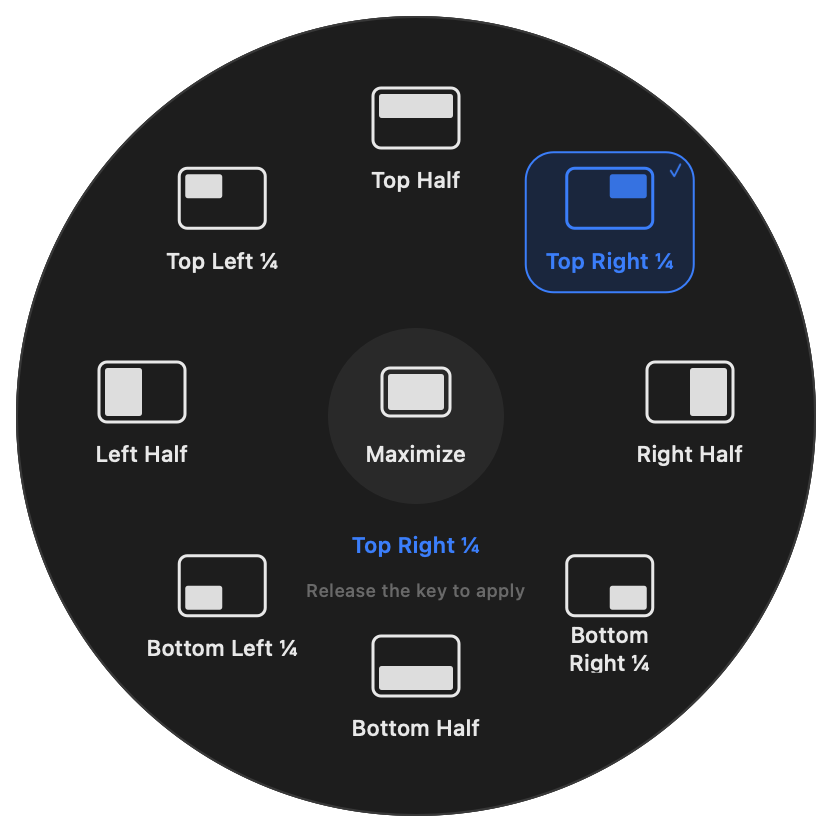

  

# Flicklane

[한국어](README.md) · **English**

**Gestures, keyboard macros, window tiling, Quick Menu, and mouse sensitivity in one app.**

Flicklane connects everyday Mac actions to the way you work. Record a gesture or choose a key sequence to copy, paste, capture the screen, open an app, and more.

[**Download Flicklane 0.1.6 Beta 1 (.zip)**](https://github.com/zamk-DAV/trackpad/releases/download/v0.1.6-beta.1/Flicklane-0.1.6-25-universal.zip) · **build 25 · Apple silicon + Intel**

Developer ID signed and Apple notarized · Targets macOS 14 / 15 / 26 · Korean, English, Japanese, Simplified Chinese, and Traditional Chinese

[Installation](docs/installation.en.md) · [User guide](docs/usage.en.md) · [Changelog](CHANGELOG.md) · [Report an issue](https://github.com/zamk-DAV/trackpad/issues) · [♥ Support](SPONSORING.md)

## What is new in this release

- **Dock and USB receiver discovery:** Fixed devices connected after app launch being missed. Automatic discovery and manual refresh now use a fresh device list.
- **Verified pointer settings:** Unchanged settings are no longer treated as successfully applied. Failed changes trigger an attempt to restore earlier values.
- **Clear trackpad limits:** Devices without verifiable per-device settings show “Not applied” with disabled controls and a shortcut to macOS pointer settings. **This update does not implement direct sensitivity control for the affected built-in trackpad.**
- **Acceleration-off guidance:** Speed controls are disabled for legacy modes that ignore the multiplier, with the affected devices named. New messages support all five languages.

[Full 0.1.6 Beta 1 release notes and verification](docs/releases/0.1.6-beta.1.md)

0.1.5 circular Window Layout menu · native rendering with example bindings.

## Five ways to work

| Feature | How to use it |
| --- | --- |
| [Gesture](docs/usage.en.md#gestures) | Choose a built-in gesture or record touches, taps, and movements. Adjust the time between touches and movement duration separately. |
| [Keyboard macros](docs/usage.en.md#keyboard-macros) | Use a released-key sequence, such as Q then W, or a combination such as Shift + 1. Send keys, shortcuts, or typed text; set a sequence interval from 0.01 to 5 seconds. |
| [Window Layout](docs/usage.en.md#window-tiling) | Hold a key and move the pointer to place the active window. Customize nine circular-menu positions and repeat a placement to restore. |
| [Quick Menu](docs/usage.en.md#quick-menu) | Choose frequently used actions beside the cursor. Link each position to a single action or a saved keyboard macro, and preview without executing actions. |
| [Mouse Sensitivity](docs/usage.en.md#mouse-sensitivity) | Set mouse/trackpad scroll directions and external-device reversal. Adjust pointer speed and acceleration on devices that support it. |

Chain multiple actions and choose which apps a rule applies to. Start with **Fast / Default / Relaxed** keyboard timing or **As recorded / A little extra / More extra time** gesture timing, then fine-tune it.

## Get started in three steps

1. Download and unzip the app, then move `Flicklane.app` to **Applications** and open it. Quit the previous app before updating.
2. Grant permissions for the features you use. If prompted to validate input, **place two fingers briefly, then lift both.**
3. Choose a feature at the top. For gesture and keyboard rules, set the input and actions, test, then enable the rule. Configure activation keys in the Window Layout and Quick Menu tabs.

To start with Quick Menu, choose **Quick Menu → a position → Change action → Preview menu**, then turn on **Enable Quick Menu**. [Layouts and Fn activation](docs/usage.en.md#quick-menu)

## Compatibility

| Environment | Support and validation |
| --- | --- |
| Apple silicon · built-in trackpad · macOS builds `25F84`, `25G83` | Existing local hardware validation covers these builds. This does not cover every Mac model. |
| Apple silicon · built-in trackpad · other builds of macOS 14 / 15 / 26 | Compatibility targets. Live contact input is checked at startup. Physical behavior across all Mac and OS combinations is unverified. |
| Intel · built-in trackpad · macOS 14 / 15 / 26 | The universal app includes an Intel executable and checks live input at startup. Physical Intel hardware behavior is unverified. |
| External Apple Magic Trackpad · macOS 14 / 15 / 26 | Enabled after matching contact and click input to the same trackpad and passing startup input validation. Physical external trackpad behavior is unverified. |
| Other macOS versions | Trackpad contact input remains disabled. |

Flicklane uses one trackpad at a time, preferring an eligible external Magic Trackpad and otherwise using the built-in trackpad. It checks devices again when connections change. Ordinary mice and Magic Mouse are excluded from trackpad input. Older and newer models must pass the same device and live-input checks; a model name alone does not establish compatibility. Pressure-based gestures require pressure data and are unavailable on trackpads without Force Touch.

For a new compatibility environment or an external trackpad, connected actions remain inactive during the input check. Failed validation stops input. Trackpad input uses the private MultitouchSupport framework and may need validation again after a macOS update.

[Release artifact checks](https://github.com/zamk-DAV/trackpad/actions/workflows/compatibility.yml) cover checksums, signing, notarization, resources, and executable structure on macOS 14 Apple silicon and macOS 15/26 Apple silicon and Intel. **0.1.6 Beta 1 [passed all five environments](https://github.com/zamk-DAV/trackpad/actions/runs/36134078734).** macOS 14 Intel is outside this CI matrix. These checks do not exercise gestures, permissions, Bluetooth, or wake behavior.

## Updates and help

Use the gear button at the top right of the main window, then **Check for Updates**. Download and replace the app yourself. In the menu bar, **⚙ Settings** opens the main window and **⏻ Quit** exits the app.

For capture problems, check **Input Status and Permissions → Screen Recording**. If Fn also opens emoji, or Quick Menu conflicts with Window Layout, see [troubleshooting](docs/usage.en.md#troubleshooting).

Report the feature, steps, and expected result in [Issues](https://github.com/zamk-DAV/trackpad/issues). **Preview Diagnostics → Copy Diagnostics** includes only version, environment, permission, and input-status fields. Nothing is sent automatically. [Privacy](PRIVACY.en.md)

This repository publishes **app downloads and documentation**. The app source code is not public. [♥ Supporting development](https://buymeacoffee.com/flicklane) is optional.

[Share Flicklane in Korean or English](docs/share.md) · [UI previews](docs/media.md) · [All releases](https://github.com/zamk-DAV/trackpad/releases)
