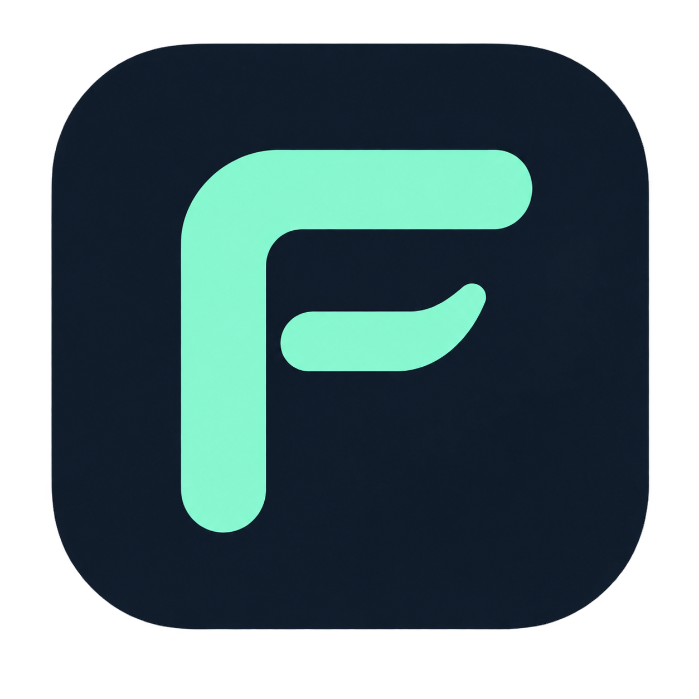
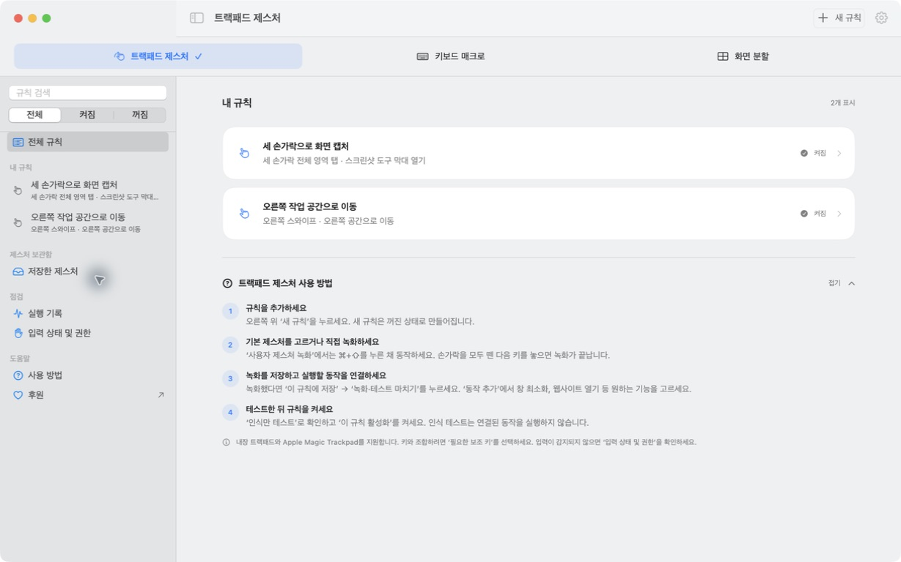

  

# Flicklane

[한국어](README.md) · **English**

**Connect your Mac’s trackpad gestures and keyboard input to the actions you use every day.**

[**Download Flicklane (.zip)**](https://github.com/zamk-DAV/trackpad/releases/download/v0.1.1-beta.1/Flicklane-0.1.1-20-universal.zip) · **0.1.1 Beta 1 · build 20 · Apple silicon + Intel**

[Installation](docs/installation.en.md) · [User guide](docs/usage.en.md) · [Release notes](https://github.com/zamk-DAV/trackpad/releases/tag/v0.1.1-beta.1) · [Report an issue](https://github.com/zamk-DAV/trackpad/issues) · [♥ Support](https://buymeacoffee.com/flicklane)

Flicklane is a macOS app for recorded gestures, keyboard sequences, shortcuts, and window tiling. This repository hosts downloads and documentation. The application source code is not published here.

*Actual app UI with example settings, input monitoring and action execution disabled. These images do not demonstrate physical trackpad testing.*

## Get started in three steps

1. Download and unzip the app above.
2. Move `Flicklane.app` to **Applications** and open it. Quit the existing app before updating.
3. Grant the permissions you need and create your first rule. If prompted to check input, **place two fingers on the trackpad briefly, then lift both fingers.**

## Compatibility

| Environment | Support and validation |
| --- | --- |
| Apple silicon · built-in trackpad · macOS builds `25F84`, `25G83` | Existing local hardware validation covers these builds. This does not cover every Mac model. |
| Apple silicon · built-in trackpad · other builds of macOS 14 / 15 / 26 | Compatibility targets. Live contact input is checked at startup. Physical behavior across all Mac and OS combinations is unverified. |
| Intel · built-in trackpad · macOS 14 / 15 / 26 | The universal app includes an Intel executable and checks live input at startup. Physical Intel hardware behavior is unverified. |
| External Apple Magic Trackpad · macOS 14 / 15 / 26 | Enabled after matching contact and click input to the same trackpad and passing startup input validation. Physical external trackpad behavior is unverified. |
| Other macOS versions | Trackpad contact input remains disabled. |

Flicklane uses one trackpad at a time, preferring an eligible external Magic Trackpad and otherwise using the built-in trackpad. It checks devices again when connections change. Ordinary mice and Magic Mouse are excluded from trackpad input. Older and newer models must pass the same device and live-input checks; a model name alone does not establish compatibility. Pressure-based gestures require pressure data and are unavailable on trackpads without Force Touch.

For a new compatibility environment or an external trackpad, connected actions remain inactive during the input check. Failed validation stops input. Trackpad input uses the private MultitouchSupport framework and may need validation again after a macOS update.

[Release artifact checks](https://github.com/zamk-DAV/trackpad/actions/workflows/compatibility.yml) cover checksums, signing, notarization, resources, and executable structure on macOS 14 Apple silicon and macOS 15/26 Apple silicon and Intel. **0.1.1 Beta 1 [passed all five environments](https://github.com/zamk-DAV/trackpad/actions/runs/35547751009).** macOS 14 Intel is outside this CI matrix. These checks do not exercise gestures, permissions, Bluetooth, or wake behavior.

## Features

| Feature | How it works |
| --- | --- |
| Trackpad gestures | Choose a built-in gesture or record your own touches, taps, and movements. |
| Timing controls | Start with **Fast / Default / Relaxed** for keyboard sequences or **As recorded / A little extra / More extra time** for recorded gestures, then adjust the details. |
| Keyboard macros | Connect sequences of released keys or modifier-key combinations to actions. |
| Window tiling | Hold a key and move the pointer to place a window in a half, quarter, or the full desktop area. |
| Multiple actions | Chain opening apps or websites, managing windows, and entering keys or text. |
| Per-app rules | Choose target apps, test recognition and execution, then enable the rule. |
| Settings and help | Choose a language, check for updates manually, and copy diagnostics for a support report. |

*An 11-second loop: rules → Fast and Relaxed keyboard timing → permission guidance. It uses example settings without live input or action execution.*

Flicklane supports Korean, English, Japanese, Simplified Chinese, and Traditional Chinese. See the [user guide](docs/usage.en.md) for recording and timing, or [installation](docs/installation.en.md) to repair permissions.

## Updates and feedback

Select **Check for Updates** in app settings to look for new GitHub releases. Download and replace the app yourself. You can also select **Watch → Custom → Releases** on GitHub for release notifications.

Report problems through [Issues](https://github.com/zamk-DAV/trackpad/issues), including steps to reproduce. **Preview Diagnostics → Copy Diagnostics** in settings copies a limited set of technical details. Input recognition and rule storage run locally. The [privacy guide](PRIVACY.en.md) explains update requests and diagnostic contents.

[♥ Supporting development](https://buymeacoffee.com/flicklane) is optional. [Support details](SPONSORING.md) · [Share Flicklane](docs/share.md)
