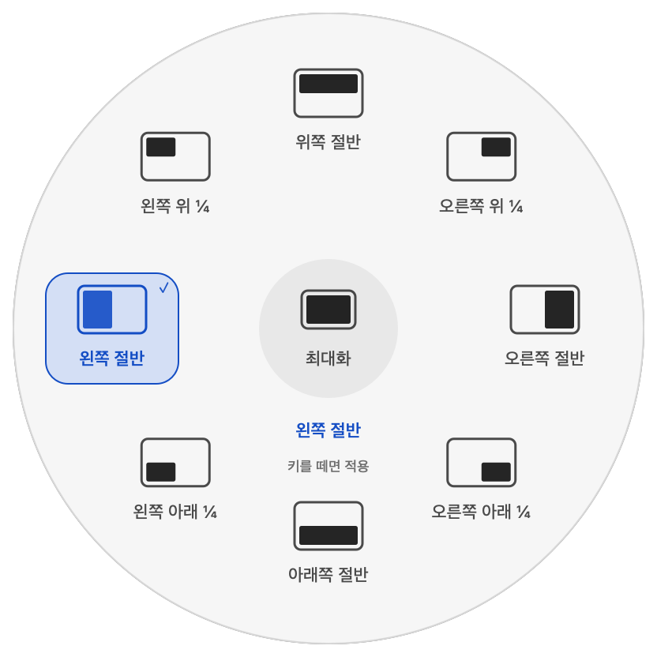

  

# 트랙패드 · Flicklane

**한국어** · [English](README.en.md)

**제스처, 키보드 매크로, 화면 분할, 퀵 메뉴와 마우스 감도 조절을 한 앱에서.**

Flicklane(플릭레인)은 자주 쓰는 Mac 동작을 내 손에 맞게 연결하는 앱입니다. 트랙패드 동작을 녹화하거나 키 입력 순서를 정하고, 복사·붙여넣기·화면 캡처·앱 열기 같은 동작을 실행하세요.

[**Flicklane 0.1.5 Beta 1 다운로드 (.zip)**](https://github.com/zamk-DAV/trackpad/releases/download/v0.1.5-beta.1/Flicklane-0.1.5-24-universal.zip) · **빌드 24 · Apple silicon + Intel**

Developer ID 서명 및 Apple 공증 완료 · macOS 14 / 15 / 26 대상 · 한국어·영어·일본어·중국어 간체/번체

[설치 안내](docs/installation.md) · [사용법](docs/usage.md) · [변경 내역](CHANGELOG.md) · [오류 제보](https://github.com/zamk-DAV/trackpad/issues) · [♥ 후원](SPONSORING.md)

## 이번 버전에서 달라진 점

- **새 원형 화면 분할 메뉴:** 큰 배치 아이콘과 선택 강조, 가운데 동작·복원 안내를 제공합니다. 9개 위치에 원하는 배치를 연결하고 동작 이름 표시를 켜거나 끌 수 있습니다.
- **배치 확장과 복원:** 절반·사분면·3등분·4열·6분할 등을 지원합니다. 같은 배치를 다시 실행하면 이전 위치와 크기로 돌아갑니다.
- **마우스 감도 조절:** 마우스와 트랙패드의 스크롤 방향을 따로 설정하고 외장 장치만 자동 반전할 수 있습니다. 포인터 속도·가속 조절과 가속 끄기도 추가했습니다.
- **직접 해보는 사용 방법:** 제스처·키보드·화면 분할·퀵 메뉴를 안내 화면 안에서 눌러보며 익힙니다. 새 기능과 안내도 5개 언어를 지원합니다.

[0.1.5 Beta 1 전체 변경 내역과 검증 결과](docs/releases/0.1.5-beta.1.md)

0.1.5 원형 화면 분할 메뉴 · 예시 배치를 렌더링한 화면입니다.

## 다섯 가지 기능

| 기능 | 이렇게 사용하세요 |
| --- | --- |
| [제스처](docs/usage.md#제스처) | 기본 제스처를 고르거나 접촉·탭·이동 순서를 직접 녹화합니다. 터치 사이 간격과 동작 길이의 시간 여유를 따로 조절합니다. |
| [키보드 매크로](docs/usage.md#키보드-매크로) | Q를 눌렀다 떼고 W를 누르는 순서 입력이나 Shift + 1 같은 키 조합을 연결합니다. 키·단축키 출력과 문구 타이핑을 연결하며, 순서 입력의 최대 간격은 0.01~5초입니다. |
| [화면 분할](docs/usage.md#화면-분할) | 실행 키를 누른 채 포인터를 움직여 창을 원하는 크기로 배치합니다. 원형 메뉴 9개 위치를 바꾸고 같은 배치를 반복해 복원합니다. |
| [퀵 메뉴](docs/usage.md#퀵-메뉴) | 복사, 붙여넣기, 캡처 등 자주 쓰는 동작을 커서 주변에서 선택합니다. 위치별 동작이나 저장한 키보드 매크로를 연결하고 실행 없이 미리 볼 수 있습니다. |
| [마우스 감도 조절](docs/usage.md#마우스-감도-조절) | 마우스·트랙패드별 스크롤 방향, 외장 장치 자동 반전, 포인터 속도·가속을 설정합니다. |

여러 동작을 순서대로 연결하고 앱별 적용 범위를 정할 수 있습니다. 키보드는 **빠르게 / 기본 / 여유롭게**, 녹화 제스처는 **녹화 기준 / 여유 조금 / 여유 많이**로 시작한 뒤 세부 시간을 조절하세요.

## 세 단계로 시작하기

1. ZIP을 받아 압축을 풀고 `Flicklane.app`을 **응용 프로그램**으로 옮겨 엽니다. 업데이트라면 기존 앱을 먼저 종료하세요.
2. 사용할 기능의 권한을 허용합니다. 입력 확인 안내가 나오면 **손가락 두 개를 잠시 올렸다가 모두 떼세요.**
3. 상단에서 원하는 기능을 고릅니다. 제스처·키보드 규칙은 입력과 실행 동작을 정해 테스트한 뒤 켜고, 화면 분할·퀵 메뉴는 각 탭에서 실행 키를 설정하세요.

퀵 메뉴부터 시작하려면 **퀵 메뉴 → 위치 선택 → 동작 변경 → 메뉴 미리보기** 순서로 확인한 뒤 **퀵 메뉴 사용**을 켜세요. [배치와 Fn 사용법](docs/usage.md#퀵-메뉴)

## 지원 범위

| 환경 | 지원 및 검증 상태 |
| --- | --- |
| Apple silicon · 내장 트랙패드 · macOS 빌드 `25F84`, `25G83` | 기존 로컬 실기기 검증 범위입니다. 모든 Mac 모델을 검증한 것은 아닙니다. |
| Apple silicon · 내장 트랙패드 · macOS 14 / 15 / 26의 다른 빌드 | 호환 대상으로 확장했습니다. 시작 시 실제 접촉 입력을 검사한 뒤 사용합니다. 전체 기기·OS 조합의 실기기 동작은 미검증입니다. |
| Intel · 내장 트랙패드 · macOS 14 / 15 / 26 | Universal 앱에 Intel 실행 파일을 포함합니다. 시작 시 입력 검사를 수행하며, Intel 실기기 동작은 미검증입니다. |
| 외장 Apple Magic Trackpad · macOS 14 / 15 / 26 | 연결된 기기의 접촉·클릭 입력이 같은 트랙패드인지 확인하고 시작 시 입력 검사를 통과하면 활성화합니다. 외장 기기의 실기기 동작은 미검증입니다. |
| 그 밖의 macOS 버전 | 트랙패드 접촉 입력을 활성화하지 않습니다. |

한 번에 트랙패드 한 대를 사용하며, 사용 가능한 외장 Magic Trackpad를 우선 선택하고 없으면 내장 트랙패드를 사용합니다. 연결이 바뀌면 기기를 다시 확인합니다. 일반 마우스와 Magic Mouse는 트랙패드 입력으로 사용하지 않습니다. 구형·신형 모델을 이름만으로 허용하지 않으며, 기기의 실제 입력과 연결 관계가 확인되어야 합니다. Force Touch가 없는 기기에서는 압력 기반 제스처를 사용할 수 없습니다.

새 호환 환경과 외장 트랙패드의 입력 확인 중에는 연결된 동작이 실행되지 않습니다. 검사에 실패하면 입력을 중단합니다. 트랙패드 입력은 비공개 MultitouchSupport 프레임워크를 사용하므로 macOS 업데이트 후 재검증이 필요할 수 있습니다.

[릴리스 파일 자동 검사](https://github.com/zamk-DAV/trackpad/actions/workflows/compatibility.yml)는 macOS 14의 Apple silicon, macOS 15·26의 Apple silicon과 Intel에서 체크섬·앱 서명·공증·리소스·실행 파일 구조를 확인합니다. **0.1.5 Beta 1은 [5개 환경 모두 통과](https://github.com/zamk-DAV/trackpad/actions/runs/35934131854)했습니다.** macOS 14 Intel은 이 CI에 포함되지 않습니다. 실제 제스처·권한·블루투스·잠자기 복귀를 검사하는 작업은 아닙니다.

## 업데이트와 문의

메인 창 오른쪽 위 톱니바퀴 → **업데이트 확인**에서 새 GitHub 릴리스를 확인합니다. 다운로드와 앱 교체는 직접 진행합니다. 메뉴 막대의 **⚙ 설정**은 메인 창을 열고, **⏻ 종료**는 앱을 종료합니다.

캡처가 안 되면 **입력 상태 및 권한 → 화면 기록**을 확인하세요. Fn을 누를 때 이모티콘이 함께 열리거나 퀵 메뉴와 화면 분할이 충돌한다면 [문제 해결](docs/usage.md#문제-해결)을 참고하세요.

문제는 [Issues](https://github.com/zamk-DAV/trackpad/issues)에 기능·재현 순서·예상 결과를 남겨주세요. **진단 정보 미리보기 → 진단 정보 복사**에는 버전·환경·권한·입력 상태만 포함되며 자동 전송하지 않습니다. [개인정보 안내](PRIVACY.md)

이 저장소에는 **앱 다운로드와 안내 문서만 공개**합니다. 앱 소스 코드는 공개하지 않습니다. [♥ 개발 후원](https://buymeacoffee.com/flicklane)은 선택 사항입니다.

[한국어·영어 공유 문구](docs/share.md) · [화면 자료](docs/media.md) · [전체 릴리스](https://github.com/zamk-DAV/trackpad/releases)
