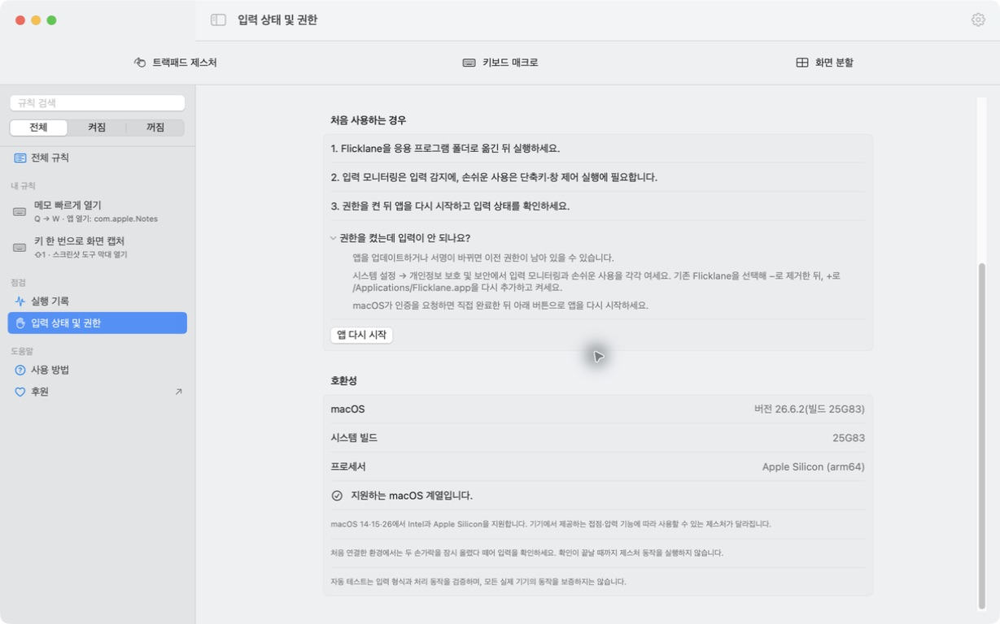

# 설치 안내

**한국어** · [English](installation.en.md)

[**Flicklane 0.1.3 Beta 1 다운로드**](https://github.com/zamk-DAV/trackpad/releases/download/v0.1.3-beta.1/Flicklane-0.1.3-22-universal.zip) · 빌드 22 · Apple silicon + Intel

## 세 단계로 설치하기

1. ZIP을 다운로드하고 압축을 풉니다.
2. `Flicklane.app`을 **응용 프로그램** 폴더로 옮겨 실행합니다. 업데이트라면 기존 Flicklane을 먼저 종료하세요.
3. 앱의 권한 안내를 따라 허용한 뒤 규칙을 만듭니다. 입력 확인 안내가 나오면 **두 손가락을 잠시 올렸다가 모두 떼세요.** macOS가 요구하면 앱을 다시 엽니다.

첫 실행 때 인터넷에서 받은 앱을 열지 확인하는 macOS 안내가 나올 수 있습니다. 보안 검사에서 차단된다면 macOS 버전과 오류 메시지를 [Issues](https://github.com/zamk-DAV/trackpad/issues)에 알려주세요.

## 호환성

macOS **14, 15, 26**의 Apple silicon·Intel Mac에서 **내장 트랙패드 또는 외장 Apple Magic Trackpad**를 대상으로 합니다. 접촉과 클릭 입력을 같은 기기에 연결할 수 있고 시작 시 입력 검사를 통과해야 합니다. 그 밖의 macOS 버전과 확인할 수 없는 기기의 트랙패드 입력은 활성화하지 않습니다.

사용 가능한 외장 Magic Trackpad가 있으면 우선 선택하고, 없으면 내장 트랙패드를 사용합니다. 한 번에 한 대의 입력만 처리합니다. 외장 기기는 USB·Bluetooth 연결로 탐색하지만 모든 세대의 연결 방식과 기능을 실기기로 확인한 것은 아닙니다. Force Touch가 없는 기기에서는 압력 기반 제스처를 사용할 수 없습니다.

Apple silicon의 빌드 `25F84`, `25G83`가 기존 로컬 실기기 검증 범위입니다. 그 밖의 대상 환경에서는 실제 접촉 데이터를 시작 시 검사합니다. **Intel용 실행 파일 포함과 입력 검사는 Intel 실기기 검증 완료를 뜻하지 않습니다.** 전체 검증 상태는 [지원 표](../README.md#지원-범위)를 참고하세요.

입력 확인은 두 손가락 접촉과 손가락을 모두 떼는 과정이 끝나야 완료됩니다. 확인 중에는 연결된 동작이 실행되지 않습니다. 앱을 다시 시작하거나 잠자기에서 복귀했을 때, 기기 연결이 바뀌었을 때 안내가 나오면 선택된 트랙패드에서 다시 확인하세요. 검사에 실패하면 권한과 macOS 버전을 확인하고 진단 정보로 문의할 수 있습니다.

## 필요한 권한



*예시 설정으로 촬영한 실제 앱 화면입니다. 입력 감지와 동작 실행을 꺼 두었으며, 실기기 동작 검증 자료가 아닙니다.*

- **입력 모니터링:** 트랙패드·키보드 입력 감지
- **손쉬운 사용:** 창·키보드·마우스 관련 동작
- **화면 기록:** 화면 캡처. 앱의 **입력 상태 및 권한 → 화면 기록**에서 현재 허용 상태를 확인하고 시스템 설정으로 이동할 수 있습니다.
- **자동화:** 설정한 다른 앱을 제어하는 동작에 필요한 경우

권한별 용도는 [개인정보 안내](../PRIVACY.md)에 정리했습니다.

### 캡처 권한 설정

앱에서 **화면 기록 설정 열기**를 누릅니다. macOS 버전에 따라 **화면 기록** 또는 **화면 및 시스템 오디오 녹음**으로 표시됩니다. 목록에 Flicklane이 없으면 `+`를 눌러 `/Applications/Flicklane.app`을 추가하고 허용한 뒤 앱을 다시 여세요.

영역·창 선택과 시스템 캡처 도구는 30초가 지나도 종료되지 않습니다. 선택 영역·창 캡처에서 Esc를 누르면 취소로 표시됩니다.

### 허용했는데 인식되지 않을 때

앱의 **입력 상태 및 권한**에서 상태를 확인하세요. 개발용 빌드나 이전 서명의 앱을 사용했다면 macOS에 오래된 권한 항목이 남아 있을 수 있습니다.

1. Flicklane을 종료하고 시스템 설정 → 개인정보 보호 및 보안 → 해당 권한 목록을 엽니다.
2. 기존 Flicklane 항목을 `−`로 제거한 뒤, `+`로 **응용 프로그램 폴더의 현재 Flicklane.app**을 다시 추가하고 허용합니다.
3. Touch ID·암호 확인은 직접 완료하고 앱을 다시 엽니다.

설정 파일이나 백업을 삭제할 필요는 없습니다. 이전 GestureForge와 Flicklane을 동시에 실행하지 마세요.

## 업데이트

설정의 **업데이트 확인**을 누르면 GitHub 릴리스를 조회합니다. 새 버전이 있으면 안내된 릴리스 페이지에서 다운로드하고 기존 앱을 종료한 뒤 교체하세요. 앱이 자동 설치하거나 설정을 업로드하지 않습니다.

규칙과 녹화 제스처는 기존 저장 위치를 유지합니다. 이전 베타는 [전체 릴리스](https://github.com/zamk-DAV/trackpad/releases)에서 확인할 수 있습니다.

<details>
<summary>선택 사항: 다운로드 체크섬 확인</summary>

[같은 릴리스](https://github.com/zamk-DAV/trackpad/releases/tag/v0.1.3-beta.1)의 ZIP과 `SHA256SUMS`를 같은 폴더에 받은 뒤 터미널에서 실행하세요.

```sh
shasum -a 256 -c SHA256SUMS
```

해당 ZIP에 `OK`가 표시되는지 확인합니다.

</details>

[사용법](usage.md) · [처음으로](../README.md)
