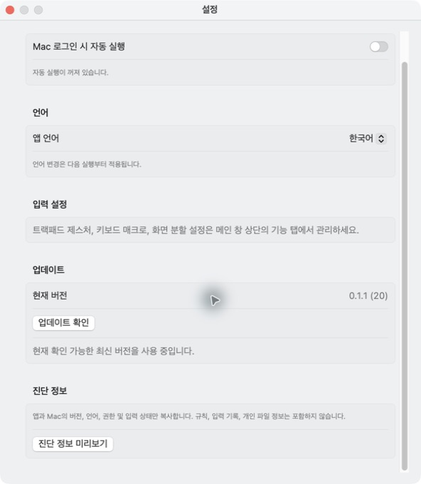

# 사용법

**한국어** · [English](usage.en.md)

아래 내용은 Flicklane 0.1.3 Beta 1의 사용 방법입니다. 처음 사용한다면 [설치 안내](installation.md)에서 지원 범위와 권한부터 확인하세요.

## 트랙패드 제스처

트랙패드 탭에서 새 규칙을 만들고 기본 제스처를 선택하거나 **사용자 제스처 녹화**를 엽니다.

한 번에 선택된 트랙패드 한 대에서 입력을 받습니다. 사용 가능한 외장 Magic Trackpad가 있으면 우선 사용하고, 없으면 내장 트랙패드를 사용합니다. 연결 변경 후 입력 확인 안내가 나오면 사용할 트랙패드에 두 손가락을 잠시 올렸다가 모두 떼세요. 이 확인 중에는 연결된 동작이 실행되지 않습니다.

접촉·탭·이동은 기기의 실제 입력으로 확인합니다. 압력 기반 제스처는 압력 데이터를 제공하는 기기에서만 사용할 수 있으며, Force Touch가 없는 구형 트랙패드는 해당 기능을 사용할 수 없습니다. 일반 클릭과 세게 누르기는 다른 입력입니다.

녹화할 때는 `⌘ + ⇧`를 누른 채 원하는 동작을 합니다. 손가락을 모두 뗀 다음 키를 놓으면 분석합니다. 이름을 정해 **이 규칙에 저장**한 뒤 녹화·테스트를 마칩니다.

여러 번 탭하거나 탭 다음에 스와이프하는 순서를 녹화할 수 있습니다. 전체 길이는 최대 5초이며, 최대 32단계와 동시 접촉 5개를 다룹니다. 센서의 접촉 순서·위치·경로를 기록하며 검지·중지 같은 손가락 이름은 구분하지 않습니다.

### 빠르거나 느린 동작에 맞추기

먼저 **녹화 기준 / 여유 조금 / 여유 많이** 중 하나를 선택하세요. 두 시간 설정을 함께 바꾸는 빠른 설정이며, 이후 각각 조절할 수 있습니다.

| 빠른 설정 | 두 항목에 추가되는 여유 |
| --- | --- |
| 녹화 기준 | +0초 |
| 여유 조금 | +0.3초 |
| 여유 많이 | +1초 |

세부 조절은 **시간 여유 조절**을 펼칩니다.

- **터치 사이 시간 여유:** 손가락을 뗐다 다시 대는 간격이나 다른 손가락을 유지한 상태에서 탭 사이에 쉬는 시간을 더 허용합니다.
- **동작 길이 여유:** 손가락을 대고 있는 시간을 녹화 때보다 짧거나 길게 허용합니다.

두 항목은 각각 0~3초를 추가로 허용하며 0.05초씩 조절할 수 있습니다. 0초는 녹화 기준의 기본 허용 범위입니다. 여유를 늘려도 전체 동작은 5초 안에 마쳐야 합니다.

**저장한 제스처**에서 바꾼 시간 설정은 그 제스처에 연결된 규칙에 함께 적용됩니다.

## 키보드 매크로

- **순서대로 입력:** Q를 눌렀다가 뗀 뒤 W를 누르는 방식입니다. 첫 키에서 손을 뗀 다음 두 번째 키를 누르세요.
- **키 조합:** Shift를 누른 채 1을 누르는 것처럼 보조 키와 일반 키를 함께 누르는 방식입니다.

순서 입력은 **빠르게(0.2초) / 기본(0.4초) / 여유롭게(1초)** 중 하나로 시작할 수 있습니다. 빠른 설정은 기존 시간 값에 바로 적용되며, 세부 값을 바꾸면 사용자 설정으로 표시됩니다.

순서 입력의 **두 키 사이 최대 시간**은 0.01~5초로 조절합니다. 첫 키를 누른 순간부터 다음 키를 누를 때까지의 제한이며, 설정한 시간 안에서는 더 빠르게 입력해도 인식합니다.

입력은 현재 사용 중인 앱에도 전달됩니다. 평소 타이핑과 겹치지 않는 조합을 선택하세요.

## 퀵 메뉴

퀵 메뉴 탭에서 4·5·8·9개 배치를 고르고 각 위치의 동작을 설정합니다. 전용 키를 켜고 사용할 키를 선택하거나, 규칙에 퀵 메뉴 동작을 연결하세요. Fn / 🌐도 실행 키로 사용할 수 있습니다.

전용 키로 열면 키를 누른 채 포인터를 움직이고 키를 떼어 선택합니다. 규칙으로 열면 항목을 클릭합니다. Esc 또는 다른 앱으로 이동하면 취소합니다. 화면 분할과 같은 실행 키를 선택하면 화면 분할이 우선하므로 서로 다른 키를 사용하세요.

## 화면 분할

**화면 분할** 탭에서 기능을 켜고 실행 키를 정합니다. 배치할 창을 선택한 뒤 실행 키를 누른 채 마우스를 움직이고 키를 놓습니다.

- 중앙: 현재 데스크톱에서 최대화
- 상·하·좌·우: 화면의 절반
- 대각선: 화면의 사분면

클릭·드래그·스크롤을 시작하면 선택이 해제됩니다. 앱별 최소 창 크기에 따라 정확한 분할 크기가 달라질 수 있습니다.

## 규칙 테스트와 관리

**입력 설정 → 실행 동작 → 적용 및 테스트** 순서로 설정합니다. 여러 동작은 위에서 아래로 실행합니다. 각 동작의 더 보기 메뉴에서 순서를 바꾸거나 삭제할 수 있습니다.

**인식만 테스트**는 연결된 동작을 실행하지 않습니다. **동작 테스트**는 3초 뒤 실제 동작을 한 번 실행하므로 사용할 대상 창으로 이동하세요. 규칙 복제·이름 관리·삭제는 활성화 스위치 옆 관리 메뉴에 있습니다.

## 설정, 업데이트와 진단 정보

*예시 설정으로 촬영한 실제 앱 화면입니다. 입력 감지와 동작 실행을 꺼 두었으며, 실기기 동작 검증 자료가 아닙니다.*

메인 창 오른쪽 위 톱니바퀴에서 설정을 엽니다.

- **업데이트 확인:** 버튼을 누를 때만 GitHub 릴리스를 조회합니다. 새 버전이 있으면 릴리스 페이지에서 직접 다운로드하세요. 자동 설치는 하지 않습니다.
- **진단 정보 미리보기 → 진단 정보 복사:** 앱 버전, macOS 버전·빌드, CPU 아키텍처, Mac 모델, 언어, 권한과 입력 상태를 확인한 뒤 클립보드에 복사합니다. 규칙·입력 기록·파일 경로는 포함하지 않으며 자동 전송하지 않습니다.

업데이트 확인에 실패하면 인터넷 연결을 확인하고 다시 시도하세요. GitHub 요청 한도 안내가 나오면 잠시 뒤 재시도할 수 있습니다. 문의는 [Issues](https://github.com/zamk-DAV/trackpad/issues)에 재현 순서와 함께 남겨주세요.

## 언어와 메뉴 막대

메인 창 오른쪽 위 톱니바퀴 → **언어**에서 시스템 설정 따르기, 한국어, 영어, 일본어, 중국어 간체·번체 중 하나를 선택합니다. 언어 변경은 재실행 후 적용됩니다. 녹화나 테스트 중이라면 작업을 마친 뒤 다시 시작하세요.

상단 메뉴 막대의 Flicklane 아이콘에는 다음 세 항목이 있습니다.

- **♥ 후원:** 기본 브라우저로 [후원 페이지](https://buymeacoffee.com/flicklane)를 엽니다.
- **⚙ 설정:** 앱 메인 창을 엽니다. 이미 열려 있으면 해당 창으로 돌아갑니다.
- **⏻ 종료:** 앱을 종료합니다.

## 동작 취소와 텍스트 입력

영역·창 캡처에서 Esc로 취소하거나 확인창에서 실행을 취소하면, 그 실행에 연결된 나머지 동작도 멈춥니다. 이미 실행한 동작은 되돌리지 않습니다. 오류 후 계속하기 설정과 관계없이 명시적인 취소를 우선합니다.

텍스트 입력은 이모지와 확장 한자가 이벤트 경계에서 잘리지 않도록 처리합니다.

[처음으로](../README.md) · [설치 안내](installation.md) · [개인정보 안내](../PRIVACY.md)
